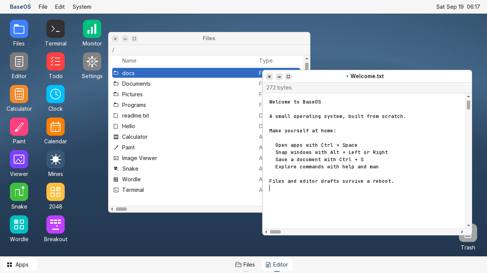
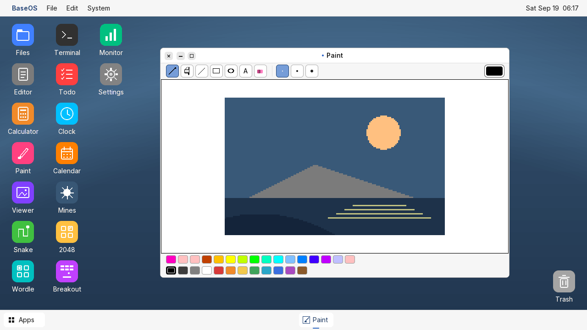
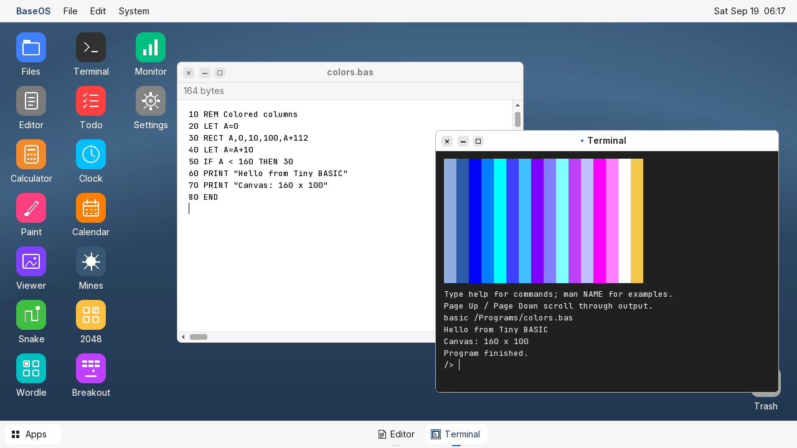
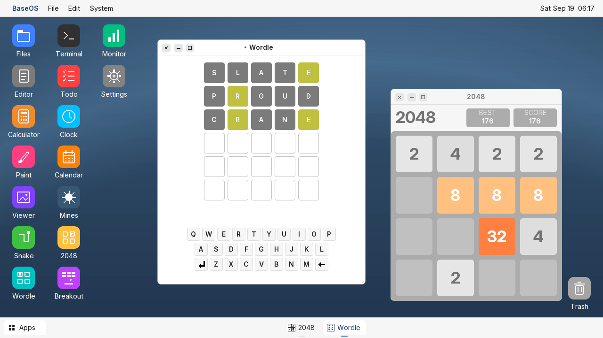
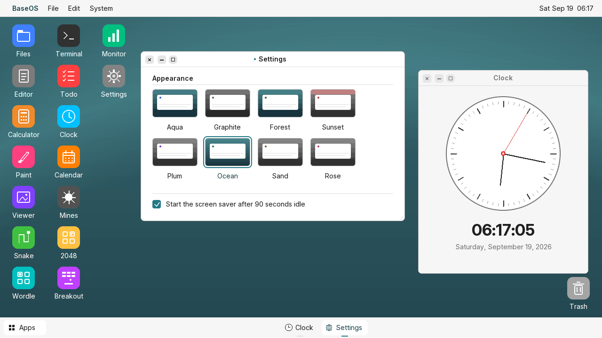
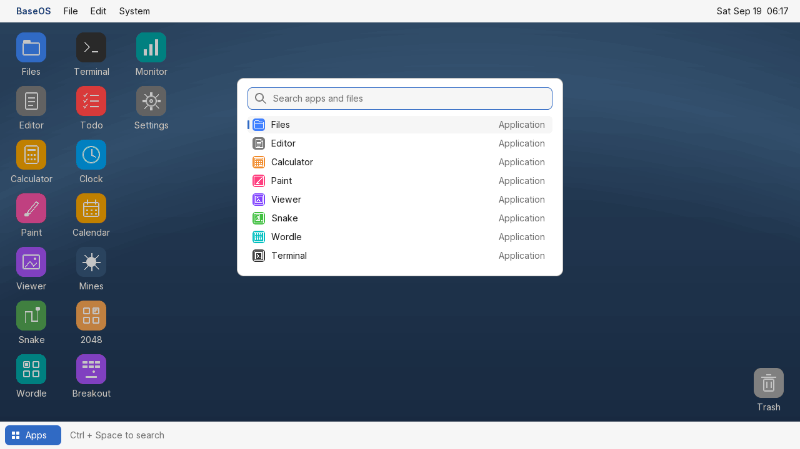

# BaseOS

A small hobby operating system written from scratch in C and x86 assembly. It boots directly into a graphical desktop with movable windows, persistent files, a text editor, Paint, a terminal, and games.

BaseOS runs in QEMU with 32 MB of RAM. The desktop is rendered entirely in software at 1280 × 720, using a 256-color backbuffer and antialiased bitmap fonts.



## What you can do

- Open up to eight windows. Move, resize, maximize, minimize, or snap them; keep separate documents, folders, and terminals open.
- Write and save documents in Editor. Use clipboard shortcuts and undo/redo, or draw with Paint's brushes, shapes, fill, and text tools.
- Browse files, rename and duplicate them, inspect their properties, and move them to Trash. Files persist on the boot disk.
- Search apps and files from the Apps button or `Ctrl+Space`. Choose from eight desktop themes.
- Explore the terminal with `help` and `man COMMAND`, run command scripts, write Tiny BASIC programs, or load small native x86 programs.
- Play Snake, Wordle, Mines, 2048, and Breakout. Calculator, Todo, Clock, Calendar, Image Viewer, and System Monitor are also built in.
- Resume window arrangements and editor/Paint drafts after a reboot. Exchange files with the host using the offline volume tool.

Built-in apps run cooperatively inside the kernel. Native programs have a small protected user region and a watchdog. This is an educational OS with a custom filesystem and APIs, not a Linux distribution or a POSIX environment. Networking, UEFI boot, and a general-purpose process scheduler are not implemented.

## Screenshots

These captures come from the running QEMU guest with sample documents and artwork. The desktop above and the five views below show the current interface.

### Paint

A 160 × 100 canvas with drawing tools, a color palette, undo/redo, and saved images that can be opened in Image Viewer.



### Programming

Edit a numbered BASIC program and run it in Terminal. BASIC supports integer expressions, loops, keyboard input, and a small graphics canvas. Terminal also runs command scripts and protected BEX1 native programs.



### Games

Wordle and 2048 running together. Snake, Mines, and Breakout are available from the same desktop.



### Themes and utilities

Eight saved color themes, a screen saver, and everyday utilities. Clock reads the machine's real-time clock; System Monitor reports the OS's resource and window information.



### App and file search

Click Apps or press `Ctrl+Space`, type a name, and press Enter. Arrow keys select a result and Escape closes the launcher.



## Build and run

You need Python 3, NASM, QEMU, and an ELF-targeting GCC/binutils toolchain.

### macOS

```sh
brew install nasm qemu x86_64-elf-gcc x86_64-elf-binutils
make run
```

### Linux

On Debian or Ubuntu:

```sh
sudo apt install build-essential gcc-multilib nasm qemu-system-x86 python3 clang
make run
```

`make run` builds `build/baseos.img`, a 2.88 MB floppy image, and starts QEMU with 32 MB RAM. Use `make headless` for a serial-console run without a graphical window.

Normal rebuilds preserve the filesystem area and back up an existing image before changing it. `make clean` keeps disk images and backups. Shut QEMU down before rebuilding its disk or using the host file exchange tool. Use **System → Shutdown** to flush pending saves before closing the emulator.

The normal build uses checked-in font data. Regenerating it with `python3 tools/gen_font.py` additionally requires Pillow.

## Start exploring

| Action | Shortcut or command |
| --- | --- |
| Search apps and files | `Ctrl+Space` |
| Switch windows | `Alt+Tab` |
| Snap left / right | `Alt+Left` / `Alt+Right` |
| Maximize / restore | `Alt+Enter` |
| Save Editor or Paint | `Ctrl+S` |
| Undo / redo | `Ctrl+Z` / `Ctrl+Y` |
| List terminal commands | `help` |
| Read a command's manual | `man basic` |

Try the included examples in Terminal:

```text
run /Programs/demo.sh
basic /Programs/demo.bas
exec /Programs/hello.bex
```

The [desktop and programming guide](FEATURES.md) covers all shortcuts, persistence behavior, file exchange, BASIC syntax, and the native-program ABI. The [technical reference](docs/TECHNICAL.md) covers hardware assumptions, disk recovery, memory layout, rendering, and regression checks.

## Development

```sh
make
make test
python3 tools/ui_test.py build
python3 tools/input_test.py build
python3 tools/render_test.py build --optimized
```

Host tests use AddressSanitizer and UndefinedBehaviorSanitizer. QEMU checks use disposable disk images. Additional boot, storage, and process-isolation checks are documented in the technical reference.

The compositor caches the background during window drags and uploads changed screen regions. A controlled headless QEMU benchmark rendered 20 drag frames in 31 timer ticks, about 45 FPS. This measures guest rendering, not a guaranteed display frame rate on every host.

| Directory | Contents |
| --- | --- |
| `src/` | Bootloader, kernel, graphics, filesystem, apps, and interpreters |
| `tests/` | Host and QEMU regression fixtures |
| `tools/` | Disk tools, font generation, test runners, and screenshot capture |
| `examples/` | Native assembly example |
| `assets/` | Fonts, licenses, cursor, and artwork |
| `screenshots/gallery/` | The six current README screenshots |
| `docs/` | Technical reference |
| `build/` | Generated binaries and persistent disk image, ignored by Git |

To regenerate the gallery, run `python3 tools/gallery.py build`. It links a documentation-only fixture that supplies sample app content, then captures the real guest through QEMU. It never boots or modifies your saved disk image.

## License

MIT. The bundled Inter and JetBrains Mono fonts have their own [OFL licenses](assets/fonts/).
