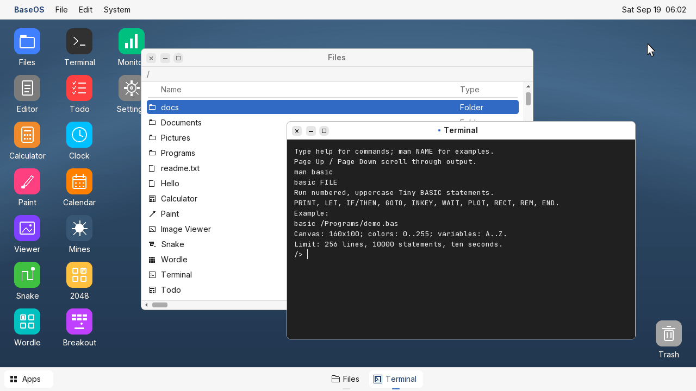

# BaseOS

A tiny 32-bit kernel written from scratch in C and assembly. It boots straight into a 1280×720 VBE desktop with a full 256-color palette, a windowing system, and a handful of built-in apps.



## What is this?

A learning project for understanding how kernels work at the lowest level. It is not POSIX and never will be, but it does handle:

- **Booting**: a 16-bit bootloader that loads the kernel, sets a VBE mode, and jumps to protected mode.
- **Graphics**: 8-bit indexed backbuffer flipped to a 32/24/16-bit linear framebuffer. Palette-driven gradients with ordered dithering, rounded chrome without dark shadow blocks, and fonts with 16 levels of antialiasing.
- **Desktop**: cached curved wallpaper, geometric app icons, neutral window frames, and a centered app switcher with an Apps search button. Eight color themes, persisted across reboots.
- **Windows and documents**: resize/maximize/snap, independent Editor/Files/Terminal windows, undo/redo, and session/draft restoration.
- **Programming**: terminal scripts, tiny BASIC with a canvas, and loadable native x86 programs with ring-3 page protection.
- **Input**: polled PS/2 keyboard and mouse.
- **Filesystem**: RAM filesystem synced to the boot floppy, so files survive a reboot.
- **Apps**: Files, a plain-text Editor with a Save As dialog, Calculator, Paint (brushes, shapes, flood fill, text), an Image Viewer, Clock, Calendar, System Monitor, and the games Snake, Wordle, Minesweeper, 2048, and Breakout.
- **Shell**: an app and file launcher (Apps button or Ctrl+Space) that searches apps and files, window minimize to the taskbar, a bouncing-logo screen saver, and a live menu-bar clock read from the CMOS RTC.
- **Fonts**: Inter for the UI and JetBrains Mono for code, rasterized to anti-aliased bitmaps by `tools/gen_font.py` (both OFL licensed, in `assets/fonts`).

## Interface

Window frames, menus, buttons, and game controls share flat neutral colors, with an accent for selections and primary actions. UI text uses lighter Inter weights. Files has column headings and type labels; the editor has wider page margins; Terminal uses light text on charcoal. Search results keep names separate from their type labels.

The bottom bar centers running apps, distinguishes active and minimized windows, and clips labels to keep all eight window targets on screen. Its Apps button opens search. Window controls have larger click targets, and the System menu contains desktop and shutdown actions. Settings retains all eight saved theme choices with updated colors.

The wallpaper is generated once per theme change and cached. This redesign retains damage-based presentation and cached dragging. The 20-frame headless QEMU benchmark still completes in 31 ticks at 70 Hz, approximately 45 FPS. Rounded outlines now preserve the pixels inside the ring, fixing circular icons and the search symbol.

## Building and running

You need Python 3, `nasm`, `qemu-system-i386`, and an ELF-targeting GCC/binutils.

**Linux** (Debian/Ubuntu):
```bash
sudo apt install build-essential gcc-multilib nasm qemu-system-x86 python3 clang
make run
```

**macOS**:
```bash
brew install nasm qemu x86_64-elf-gcc x86_64-elf-binutils
make run
```

`make run` builds a 2.88 MB floppy image at `build/baseos.img` and boots it in QEMU. `make headless` boots without a display and prints the serial log; you should see `Kernel started`, `FS ready`, `Mouse ready`, `SPLASH`, and `DESKTOP`.

See [FEATURES.md](FEATURES.md) for all ten additions, shortcuts, host file exchange, BASIC syntax, and the native executable ABI.

## Project layout

```
src/
  boot.asm          bootloader (loads KERNEL_SECTORS from the floppy to 0x10000)
  kernel_entry.asm  E820/VBE discovery, protected mode, C runtime initialization
  interrupts.asm    exception and timer interrupt entry
  platform.c        IDT, PIC, PIT timer, serial panic output
  process.c / process_entry.asm   ring-3 execution, paging, syscalls, fault recovery
  basic.c           bounded tiny BASIC interpreter
  history.c         undo/redo storage
  bootinfo.c        memory and framebuffer validation
  layout.h          shared memory and disk reservations
  kernel.c          window manager, desktop, menus, input, and the apps
  gfx.c / gfx.h     framebuffer primitives, palette, gradients, text
  fs.c / fs.h       RAM filesystem and disk sync
  persist.c         raw floppy sector I/O
  rtc.c             CMOS real-time clock
  clock.c, calendar.c, mines.c, game2048.c, breakout.c, sysmon.c   apps
  term.c, todo.c, wordle.c
  app.h             shared app helpers and theme colors
  font.h            generated bitmap fonts (see tools/gen_font.py)
  linker.ld
assets/             splash and about artwork
tools/              font generator
design/             wireframes
build/              build output (ignored by git)
```

### Build and data safety

Normal builds update only the boot/kernel reservation. Filesystem sectors survive rebuilds and `make clean`. Before updating an existing image, the build saves its previous contents as `build/baseos.img.<hash>.bak`. The updater refuses an image locked by a running QEMU guest; shut the guest down before rebuilding.

The first build with these changes extends an old 1.44 MB image to 2.88 MB without changing its existing volume bytes or LBAs. The kernel reads v1 and v2 filesystems and writes v3, which adds modification timestamps. Its first changed save goes into the second snapshot, leaving the old snapshot intact. Each snapshot holds the full existing capacity: 64 nodes with up to 16,383 data bytes per file.

Saves alternate between two snapshots. A save writes and verifies the new payload, then commits a checksummed header. On boot, the kernel validates both snapshots and loads the newest complete one. It never automatically reformats a corrupt or unreadable disk. The desktop displays a disk warning if changes are only in RAM; Shutdown stays in the desktop if flushing fails. Automatic retries are five seconds apart and stop after three failures. Selecting Shutdown explicitly retries a failed flush, unless a mount or uncertain commit has protected the disk until reboot.

A legacy 1.44 MB disk can still boot with the new loader, but is read-only for persistence until the build upgrades its size. Keep backups outside the running image for host disk failure or damage to both snapshots. The snapshot protocol protects against interrupted guest writes; it cannot guarantee durability if the host storage stack loses or reorders acknowledged writes after host power loss.

### Supported machine

BaseOS targets a legacy BIOS Pentium-or-newer x86 PC with PSE, one CPU, drive A with 80 cylinders and two heads, VBE direct-color graphics, PS/2 input, a PIC/PIT, and an ISA DMA floppy controller. Normal runs use QEMU standard VGA, 32 MB RAM, and a 2.88 MB floppy. Startup checks the BIOS E820 map for the reserved memory areas and stops if they are unavailable. It accepts matching RGB565 or RGB888 framebuffer formats and stops if video initialization fails. UEFI boot is not supported.

Built-in applications run cooperatively in the kernel. Loadable BEX1 programs run one at a time in a protected 64 KB user region, with checked syscalls and a two-second watchdog. Kernel exceptions print a serial diagnostic and halt; user-program faults return to Terminal. Only the timer interrupt is enabled among hardware IRQs; PS/2 and floppy I/O remain polled. There is no general-purpose heap or background process scheduler.

### Checks

```sh
make test
make
python3 tools/smoke_test.py build --keep
python3 tools/process_test.py build
python3 tools/ui_test.py build
python3 tools/input_test.py build
python3 tools/render_test.py build --optimized
```

`make test` uses a host C compiler with AddressSanitizer and UndefinedBehaviorSanitizer. It tests image preservation and locking, interrupted commits, corrupt filesystem data, legacy migration, full capacity, copy rollback, floppy error recovery, RTC snapshots, and memory/video validation.

The QEMU suite creates disposable images and checks fresh boot, reboot, timer progress, exception diagnostics, low-memory/video failure, deliberately dirty BSS, and multi-track storage. `--keep` preserves its logs, test disks, and desktop screenshot in the printed temporary directory. No test boots or writes your normal image.

### Memory map

| Range      | Use                         |
|------------|-----------------------------|
| `0x005000` | BIOS E820 memory map        |
| `0x010000` | kernel, checked below stack |
| `0x080000`–`0x090000` | reserved kernel stack |
| `0x200000` | 8-bit backbuffer            |
| `0x300000` | filesystem node table       |
| `0x500000` | Paint canvas / viewer arena |
| `0x700000` | disk DMA bounce buffer      |
| `0x800000` | on-disk filesystem image    |
| `0xA00000` | cached desktop wallpaper    |

Disk LBA 0 contains the loader. The kernel reservation starts at LBA 1 and ends before LBA 384. Snapshot slots start at LBAs 384 and 2784, each reserving 2400 sectors. All physical addresses, disk boundaries, and the kernel sector budget are defined in `src/layout.h` and checked by the linker, C assertions, and image builder.

### Palette

The 256-entry palette is laid out as 16 fixed base colors, a 32-step gray ramp, a 64-entry wallpaper ramp and 16-entry accent ramp that are rewritten whenever the theme changes, and a 5×5×5 color cube for everything else. Gradients dither only between neighboring ramp entries, which keeps them smooth without visible noise.

## License

MIT.

### Rendering and terminal help

Window drags cache the unchanged desktop behind the moving window. The presenter compares RAM buffers and transfers only changed horizontal spans to video memory. Palette lookups and rounded-corner coverage are cached; bulk fills/copies use x86 word operations. Background app visuals refresh when the drag finishes, while the dragged app is repainted during movement. The idle desktop sleeps until the next timer tick instead of continuously polling. Normal QEMU runs still use 32 MB; the compositor reservations now require RAM through 22 MB.

Fonts use four bits per pixel (16 coverage levels), and window masks preserve the background at all four corners. The heavy layered shadows are removed. Font generation uses the included licensed font files and requires Python with Pillow; normal builds use the checked-in generated header.

Terminal opens with a help hint. Use `help` for the command index, `help NAME` or `man NAME` for usage and examples, and Page Up/Page Down to scroll. Output wraps to the window width.

A controlled 20-frame QEMU test with five overlapping windows took 203 timer ticks before these changes and 31 afterward: about 7 versus 45 rendered frames per second, including initial cache creation. This measures guest rendering in headless QEMU, not the macOS window's displayed frame rate. The test also checks that cached composition matches a complete redraw pixel-for-pixel. Host tests cover corner clipping, palette invalidation, font access, cursor restoration, and presentation with padded 16-, 24-, and 32-bit framebuffers.
