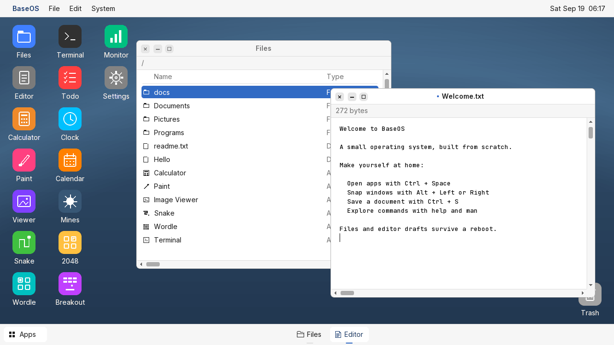
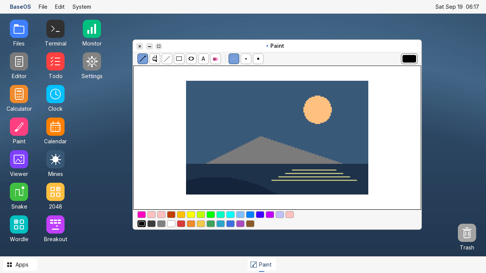
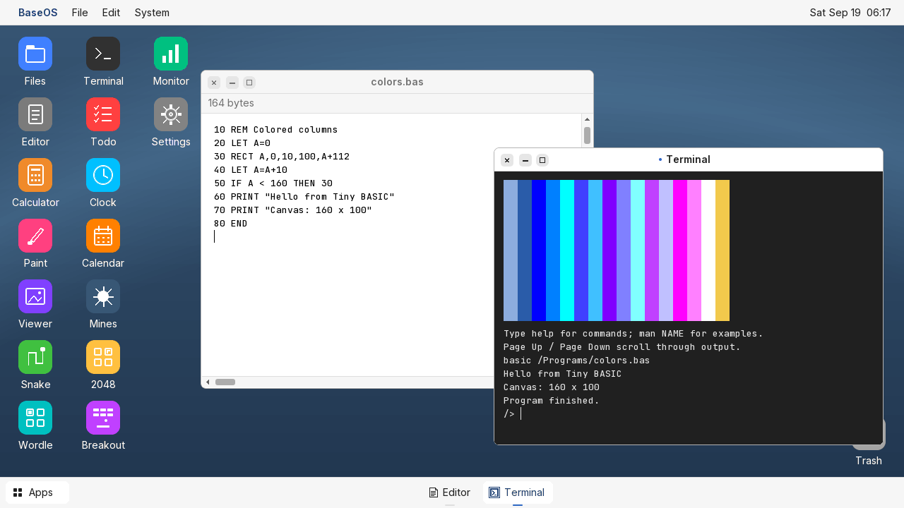
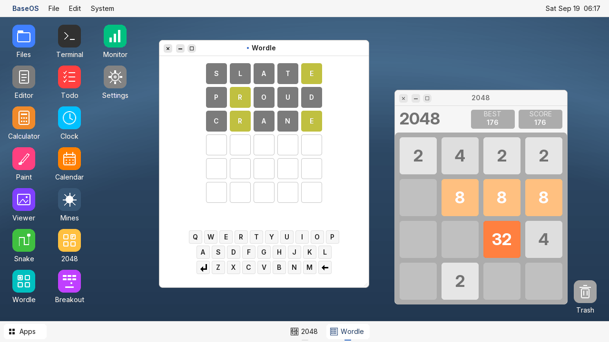
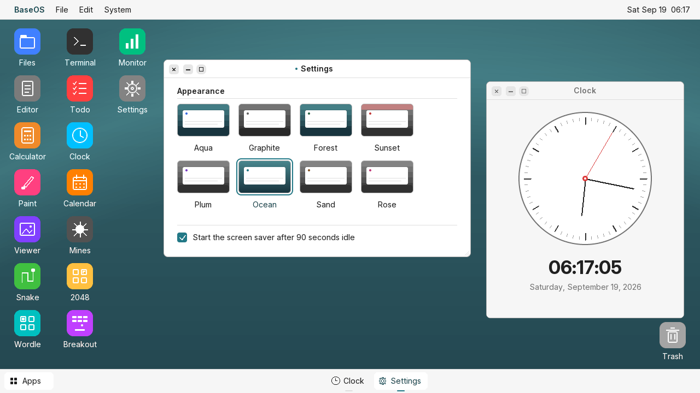
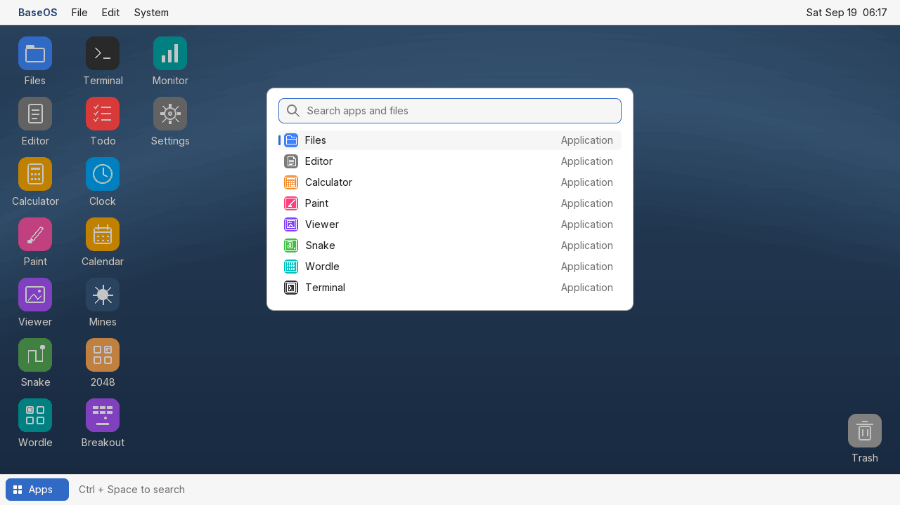

# BaseOS

A small hobby operating system written from scratch in C and x86 assembly. It boots directly into a graphical desktop with persistent files, document editing, HTTP browsing, media playback, and small protected native applications.

BaseOS runs in QEMU with 64 MiB of RAM, or 128 MiB for the optional large-data profile. The desktop is rendered entirely in software using a 256-color backbuffer and antialiased bitmap fonts. Settings switches between 800 × 600, 1024 × 768, 1280 × 720 and 1280 × 800, with a timed confirmation and automatic revert.



## What you can do

- Open up to eight windows. Move, resize, maximize, minimize or snap them; keep independent documents, folders and terminals open.
- Edit documents up to 65,535 bytes with selection, clipboard, eight undo steps, and case-sensitive or insensitive find/replace. Changed documents have Save/Discard/Cancel on close; saving confirms disk synchronization. Draw with Paint's brushes, shapes, fill and text tools.
- Calculate small budgets in Spreadsheet: a 128 x 26 grid, bounded formulas, range copy/paste, four-step undo, native .bsh files, CSV value interchange and guarded recovery. Start with Documents/budget.bsh.
- Write formatted documents with Writer: proportional wrapping, bold/italic/underline, headings, alignment, grouped undo, native save/recovery and a separate RTF export. Writer supports 32,768 ASCII text bytes; the plain Editor remains available.
- Store files up to 2 MiB on a separate 16 MiB data disk, or explicitly choose the large profile for 16 MiB files on a 64 MiB disk. Dual snapshots hold about 8 MiB or 32 MiB of file data respectively; both support 256 total file, folder and application nodes (64 in legacy floppy-only mode). Existing boot-disk files migrate without changing the old snapshots.
- Copy and move files or folders through Files with Ctrl+C/Ctrl+X/Ctrl+V or the Edit menu. Collisions never overwrite unrelated files, and stale file identities are rejected.
- Read HTTP pages in Browser, follow links, navigate history, and save complete HTML for offline reading. Download binary files with Browser’s Download button or Terminal while other apps keep running.
- Play PCM WAV and MP3 through QEMU's SB16 device, with pause, resume, volume and a playlist. Play MPEG-1 program streams with synchronized MP2 audio; 48 kHz audio is resampled to 44.1 kHz for QEMU SB16. Exact bounds are in the media guides.
- View JPEG, PNG, BMP, GIF's first frame and BaseOS images, with fit, actual size, zoom, pan and transparency. Images are bounded to 1,024 pixels per side and 786,432 pixels total.
- Build C applications up to 48 KiB with the included host SDK, keeping a 64 KiB process region and 16 KiB stack reserve. Native tasks can stream 2 MiB files, replace 32 KiB documents with explicit sync, and use an optional 320x200 canvas. The included DocStats app counts a document and displays its byte histogram.
- Run shell scripts, Tiny BASIC and the legacy synchronous `exec` interface. Calculator, Todo, Clock, Calendar and the original games remain included. System Monitor lists native tasks with Show and Stop controls, alongside resource and window information.
- Search apps and files with `Ctrl+Space`; use the mouse wheel to scroll. Restore saved window arrangements and Editor/Paint/Writer/Spreadsheet drafts after reboot.

BaseOS is an educational custom BIOS/i386 OS, not a Linux distribution or a POSIX environment. Built-ins cooperate inside the kernel; each native task has a protected 64 KiB region and a bounded execution slice. Browser is HTTP-only: no TLS/HTTPS, JavaScript, CSS layout, forms, authentication or embedded web images. There is one network request at a time. Real network tests use controlled QEMU host fixtures; public upstream DNS did not respond in the development environment, so unrestricted internet access is not claimed. UEFI and general-purpose virtual-memory processes are not implemented.

Detailed guides: [Spreadsheet](docs/SHEET.md), [Writer](docs/WRITER.md), [Browser](docs/BROWSER.md), [networking](docs/NETWORK.md), [downloads](docs/DOWNLOADS.md), [native SDK](docs/NATIVE_SDK.md), [image formats](docs/IMAGE_FORMATS.md), [Editor safety](docs/EDITOR_SAFETY.md), [task management](docs/SYSTEM_MONITOR.md), [audio](docs/MEDIA.md), [video](docs/VIDEO.md), and the [technical reference](docs/TECHNICAL.md).

## Screenshots

These captures come from the running QEMU guest with sample documents and artwork. These original gallery views show the base desktop. New feature captures are included with the development checkpoint.

### Paint

A 160 × 100 canvas with drawing tools, a color palette, undo/redo, and saved images that can be opened in Image Viewer.



### Programming

Edit a numbered BASIC program and run it in Terminal. BASIC supports integer expressions, loops, keyboard input, and a small graphics canvas. Terminal also runs command scripts and protected BEX1 native programs.



### Games

Wordle and 2048 running together. Snake, Mines, and Breakout are available from the same desktop.



### Themes and utilities

Eight saved color themes, a screen saver, and everyday utilities. Clock reads the machine's real-time clock; System Monitor reports the OS's resource and window information.



### App and file search

Click Apps or press `Ctrl+Space`, type a name, and press Enter. Arrow keys select a result and Escape closes the launcher.



## Build and run

You need Python 3, NASM, QEMU, and an ELF-targeting GCC/binutils toolchain.

### macOS

```sh
brew install nasm qemu x86_64-elf-gcc x86_64-elf-binutils
make run
```

### Linux

On Debian or Ubuntu:

```sh
sudo apt install build-essential gcc-multilib nasm qemu-system-x86 qemu-system-gui python3
make run
```

`make run` builds `build/baseos.img`, a 2.88 MB boot floppy, and creates `build/baseos-data.img`, a separate 16 MiB IDE data disk, only if it does not already exist. QEMU starts with 64 MiB RAM. Use `make headless` for a serial-console run without a graphical window. The data volume holds up to 8,385,024 file bytes, with 2 MiB per file and up to 256 total file/folder/app nodes. Metadata for nodes beyond 64 slightly reduces the byte allowance; see the technical reference.

An [optional large-volume profile](docs/LARGE_VOLUMES.md) uses 128 MiB RAM and
an explicitly created 64 MiB data disk, with 16 MiB files and about 32 MiB of
file data. The default build and existing disks stay unchanged; migration is
a copy into a new image, never an in-place resize.

Use `make run-large` (or `make headless-large`) to create or verify the separate
`build/baseos-large-data.img` and boot with 128 MiB RAM. This does not copy an
existing IDE disk: follow the guide's explicit migration command first if you
want to keep that disk's current documents. WAV/MP3 can use up to 16 MiB of source
data in this profile; Editor, Writer, MPEG and download limits are unchanged.

At the first boot with a newly marked data disk, BaseOS reads the existing floppy files and saves a copy to the data disk. Both old floppy snapshots remain untouched. Later boots use the data disk. Without the optional IDE disk, the old floppy filesystem remains usable with its original limits. An unknown or unreadable IDE disk is never formatted automatically; BaseOS exposes the boot files read-only for recovery.

The build keeps the exact linked `kernel.bin` and derives a deterministic `kernel.packed` for the BIOS boot disk. Packing can accommodate initialized kernels above the former raw disk limit, subject to compressed disk capacity and the unchanged kernel/BSS RAM bound. See the [packed boot layout](docs/TECHNICAL.md).

Normal rebuilds preserve the filesystem area and back up an existing image before changing it. `make clean` keeps both disk images and backups. Shut QEMU down before rebuilding its disk or using the host file exchange tool. Use **System → Shutdown** to flush pending saves before closing the emulator.

Host and reference-media tests additionally need Clang, FFmpeg and Pillow (`python3-pil` on Debian). The [original Harbor examples](assets/examples/) provide 18 seconds of music and a nine-second animation; release data disks include both. The normal build uses checked-in font data. Regenerating it with `python3 tools/gen_font.py` additionally requires Pillow.

## Start exploring

| Action | Shortcut or command |
| --- | --- |
| Search apps and files | `Ctrl+Space` |
| Switch windows | `Alt+Tab` |
| Snap left / right | `Alt+Left` / `Alt+Right` |
| Maximize / restore | `Alt+Enter` |
| Save Editor, Paint or a complete Browser page | `Ctrl+S` |
| Find / replace in Editor | `Ctrl+F` / `Ctrl+H` |
| Find next / previous | `F3` / `Shift+F3` |
| Undo / redo | `Ctrl+Z` / `Ctrl+Y` |
| List terminal commands | `help` |
| Read a command's manual | `man basic` |

Try the included examples in Terminal:

```text
run /Programs/demo.sh
basic /Programs/demo.bas
exec /Programs/hello.bex
start /Programs/counter.bex
```

The [desktop and programming guide](FEATURES.md) covers all shortcuts, persistence behavior, file exchange, BASIC syntax, and the native-program ABI. The [technical reference](docs/TECHNICAL.md) covers hardware assumptions, disk recovery, memory layout, rendering, and regression checks.

## Development

```sh
make
make test
python3 tools/regression.py build --extended
python3 tools/render_test.py build --optimized
```

Host tests use AddressSanitizer and UndefinedBehaviorSanitizer. If the host runs tests under ptrace, use `ASAN_OPTIONS=detect_leaks=0 make test`; this disables only unsupported LeakSanitizer, not the other sanitizers. QEMU checks use disposable disk images. Additional boot, storage, and process-isolation checks are documented in the technical reference.

The compositor caches the background during window drags and uploads changed screen regions. A controlled headless QEMU benchmark rendered 20 drag frames in 31 timer ticks, about 45 FPS. This measures guest rendering, not a guaranteed display frame rate on every host.

| Directory | Contents |
| --- | --- |
| `src/` | Bootloader, kernel, graphics, filesystem, apps, and interpreters |
| `tests/` | Host and QEMU regression fixtures |
| `tools/` | Disk tools, font generation, test runners, and screenshot capture |
| `examples/`, `sdk/` | Native assembly and C examples, application SDK |
| `assets/` | Fonts, licenses, cursor, and artwork |
| `screenshots/gallery/` | The six current README screenshots |
| `docs/` | Technical reference |
| `build/` | Generated binaries and persistent disk image, ignored by Git |

To regenerate the gallery, run `python3 tools/gallery.py build`. It links a documentation-only fixture that supplies sample app content, then captures the real guest through QEMU. It never boots or modifies your saved disk image.

## License

MIT. The bundled Inter and JetBrains Mono fonts have their own [OFL licenses](assets/fonts/). Pinned third-party decoders retain their original licenses and notices: [minimp3](third_party/minimp3/), [stb_image](third_party/stb/) and [pl_mpeg](third_party/pl_mpeg/). Local patches and attribution are recorded alongside the vendored sources.
